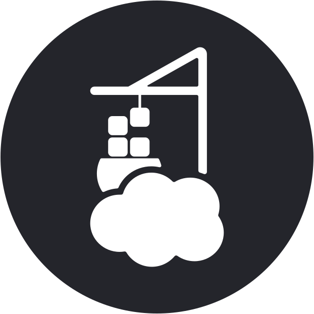

# Homarr Custom Logos

This is a collection of custom logos designed for use with [Homarr](https://homarr.dev/), created in my personal favorite style.

## Usage

Right click a logo from below, then click "copy image address" and paste it into your Homarr dashboard.

Feel free to:
- Use these logos in your own Homarr setup
- Edit the SVG files to match your needs
- Distribute these logos (with attribution)
- Open an issue to request a new logo

## Logo Collection

|  Actual_Budget |  Cloudflare |  Cloudflare_Access |  Cloudflare_Networks |  CyberChef |
|:---:|:---:|:---:|:---:|:---:|
|  Home_Assistant |  Mainsail |  Open-WebUI |  Pingvin_Share |  Portainer |
|  Proxmox |  SpotDL |  TelDrive |  Yacht |  YoutubeDL-Material |
