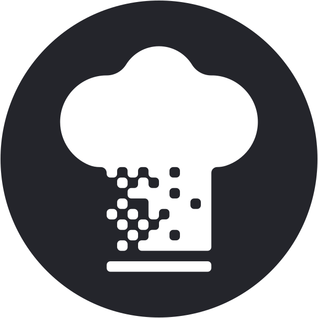
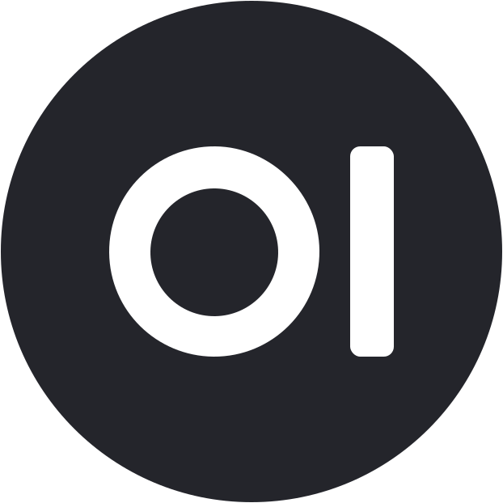

# Homarr Custom Logos

This is a collection of custom logos designed for use with [Homarr](https://homarr.dev/), created in my personal favorite style.

## Logo Collection

  

     
    Actual_Budget
  

  

     
    Cloudflare
  

  

     
    Cloudflare_Access
  

  

     
    Cloudflare_Networks
  

  

     
    CyberChef
  

  

     
    Home_Assistant
  

  

     
    Mainsail
  

  

     
    Open-WebUI
  

  

     
    Pingvin_Share
  

  

     
    Portainer
  

  

     
    Proxmox
  

  

     
    SpotDL
  

  

     
    TelDrive
  

  

     
    Yacht
  

  

     
    YoutubeDL-Material
  

## Usage

Right click a logo from above, then "copy image address" and paste it into your Homarr dashboard.

Feel free to:
- Use these logos in your own Homarr setup
- Edit the SVG files to match your needs
- Distribute these logos (with attribution)
- Open an issue to request a new logo